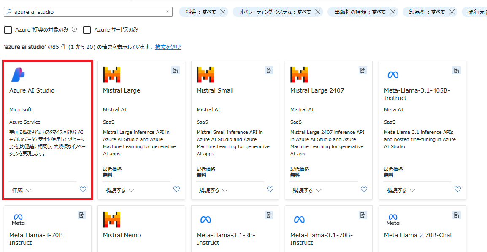
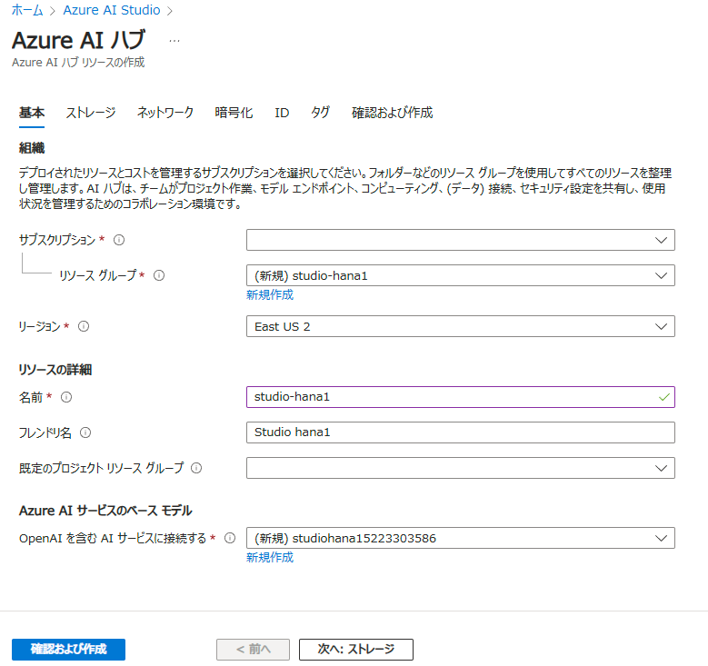
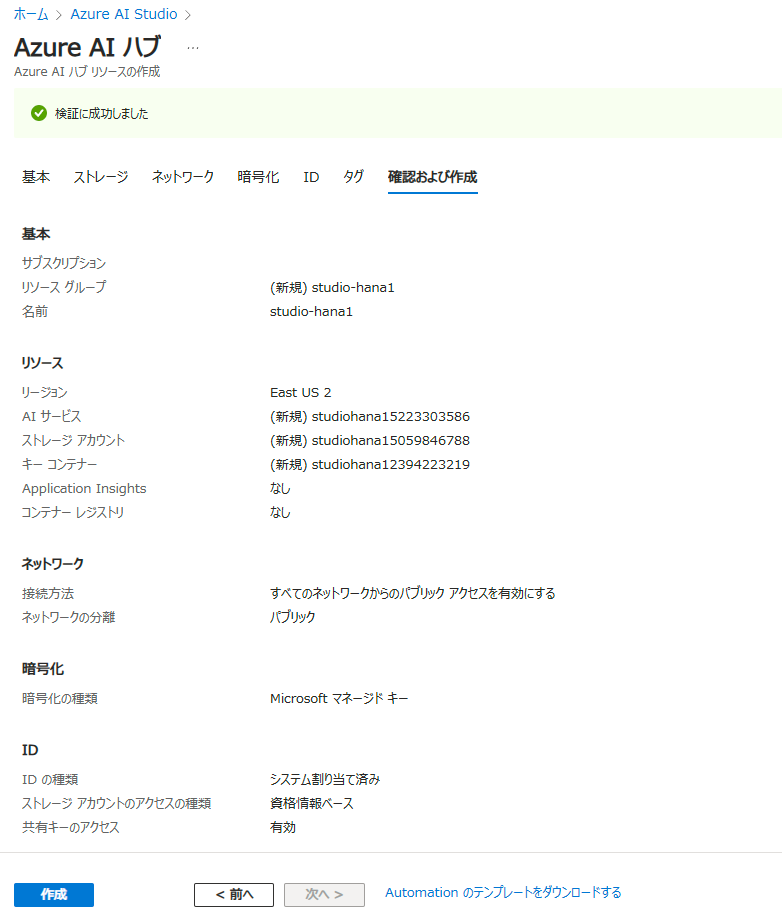
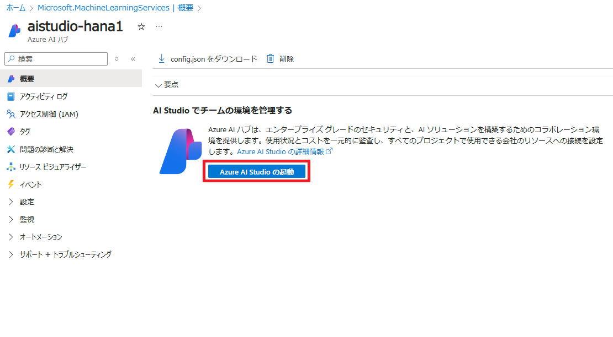

# Azure AI Studio ハブの作成
1. [Azure portal](https://portal.azure.com/) にアクセスして「リソースの作成」をクリックします。
1. 上部のテキストボックスに「azure ai studio」と入力して検索します。以下のように Azure AI Studio が表示されたら作成をクリックします。

    

1. 必要事項を以下のように入力して「確認および作成」をクリックします。※今回は「**East US 2**」リージョンに作成します。

    

1. 内容を確認して「作成」ボタンをクリックします。

    

    以下のリソースが自動的に新規作成されます。

    - Azure AI Studio ハブ
    - Azure AI services
      - Azure OpenAI Service
    - ストレージアカウント
    - キー コンテナー

1. リソースのデプロイが完了したら、リソースへ移動し「Azure AI Studio の起動」ボタンをクリックします。

    

#
[←戻る](./README.md)