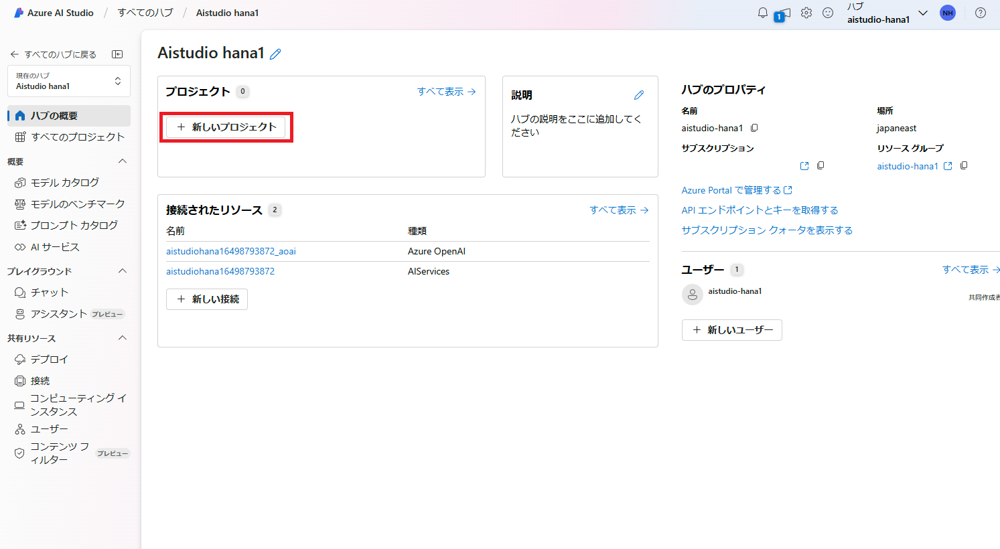
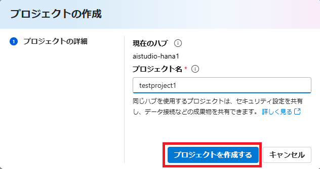
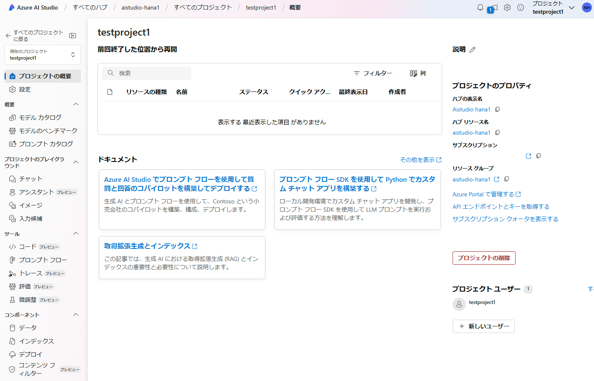
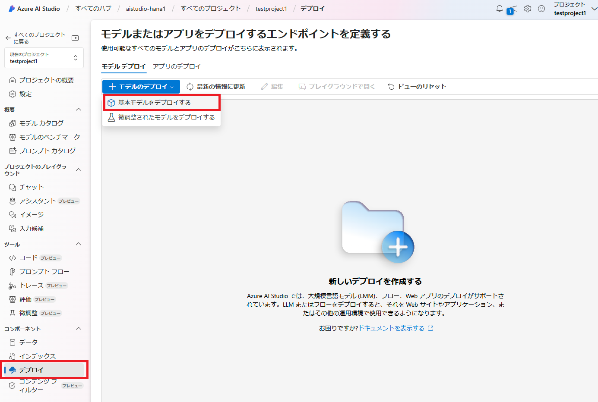
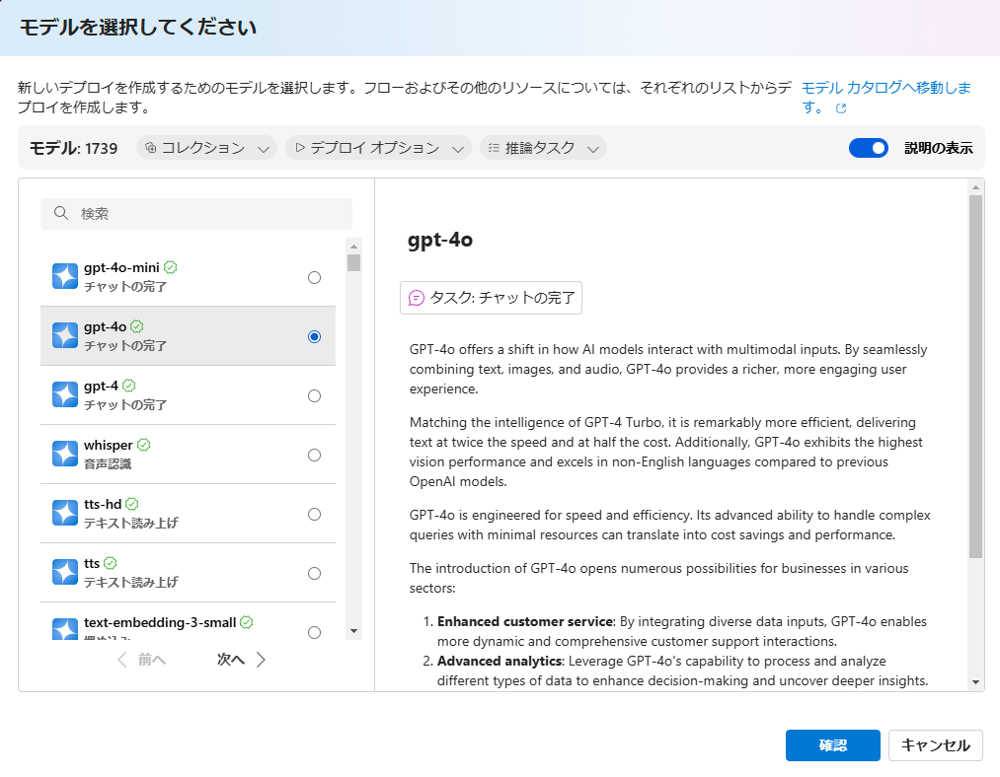
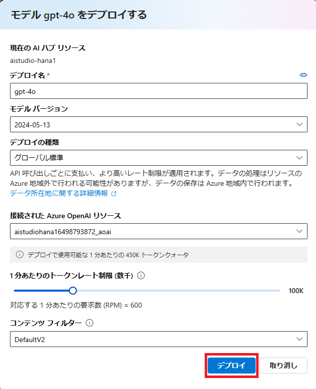
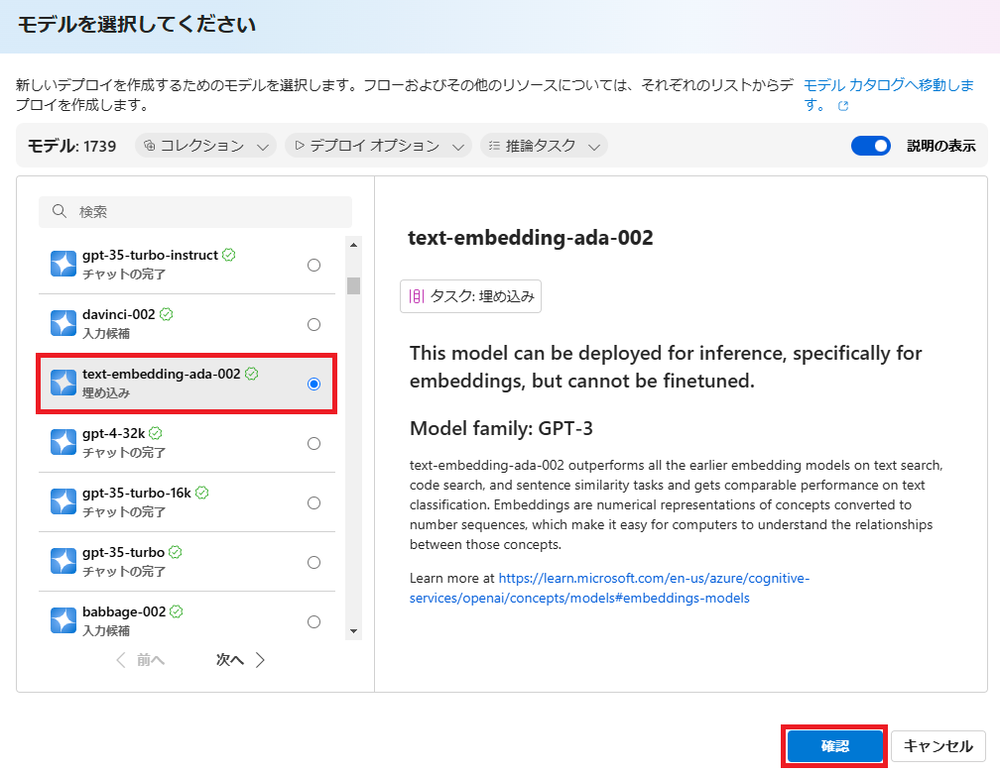
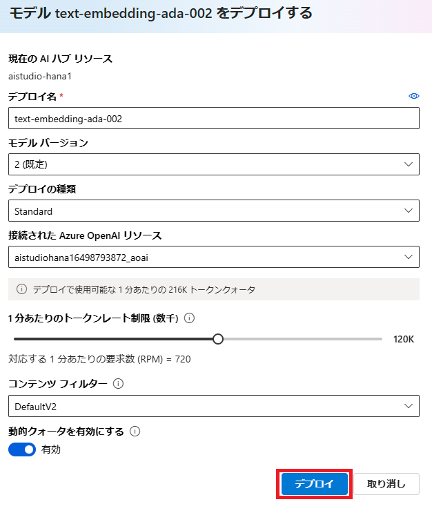
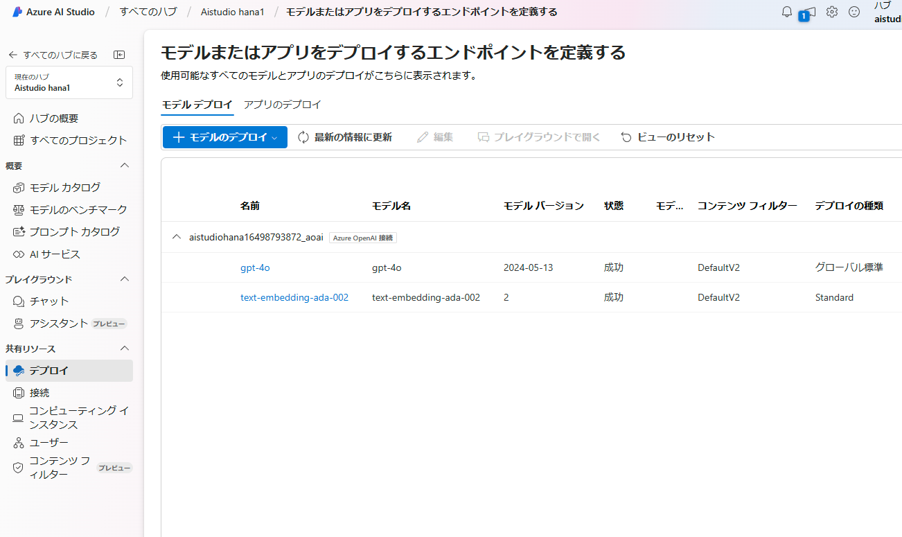

# Azure AI Studio プロジェクトの作成
1. Azure AI Studio を起動したら、最上位階層「ハブ」に新しいプロジェクトを作成します。以下のように「新しいプロジェクト」ボタンをクリックします。

    

1. 任意のプロジェクト名を入力して「プロジェクトを作成する」ボタンをクリックします。

    

1. プロジェクトが作成されると、以下のようなプロジェクト概要画面が開きます。これでプロジェクトごとにプロンプトフローを構築・管理できるようになります。

    

## Azure OpenAI モデルのデプロイ
1. 左のメニューから「デプロイ」を選択して「モデルのデプロイ」を選択し、「基本モデルをデプロイする」をクリックします。

    

1. 今回は `gpt-4o` を使用しますので、以下のようにモデルを選択し「確認」ボタンをクリックします。

    

1.  以下のようにデプロイ設定を行います。デプロイの種類は「グローバル標準」に設定します。トークンレート制限は少なめの値で問題ありません。特に同一リージョン内に他の Azure OpenAI リソースがある場合はクォータキャップに注意してください。

    

「デプロイ」ボタンをクリックするとすぐにデプロイされます。

## Embeddings モデルのデプロイ
1. モデルのデプロイから「基本モデルをデプロイする」を選択し `text-embedding-ada-002` を選択します。

    

1. デプロイ設定はデフォルトのままで構いません。そのまま「デプロイ」ボタンをクリックします。

    

1. 以下のように 2 種類の Azure OpenAI モデルがリストアップされていれば OK です。

    

#
[←戻る](./README.md)