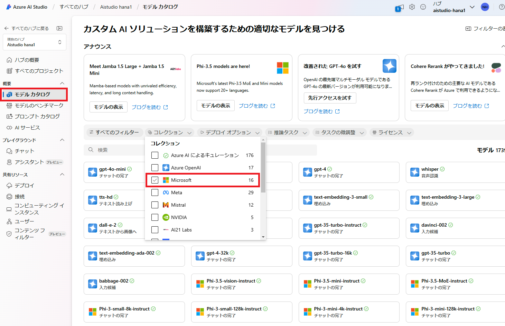
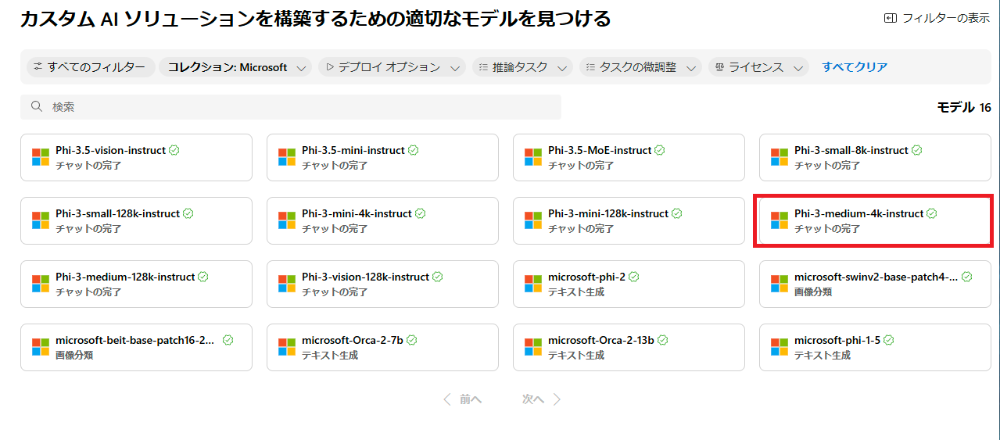
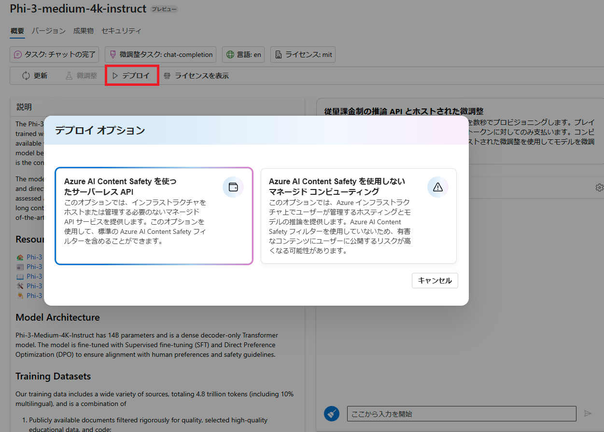
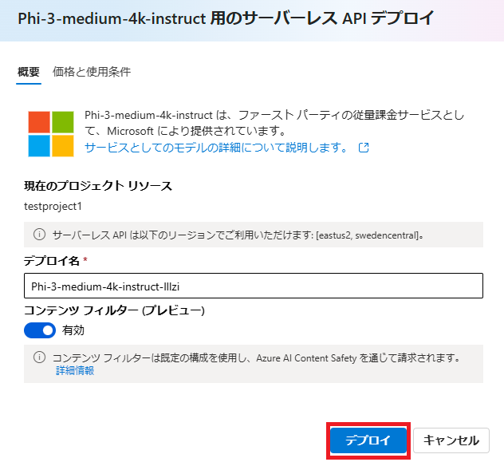
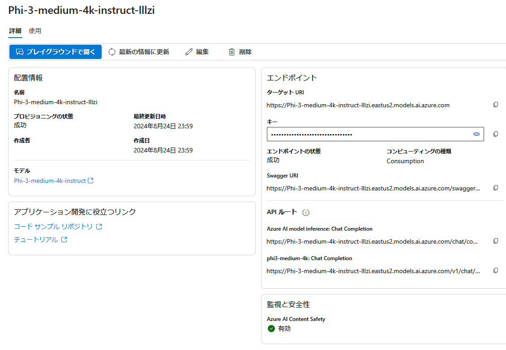
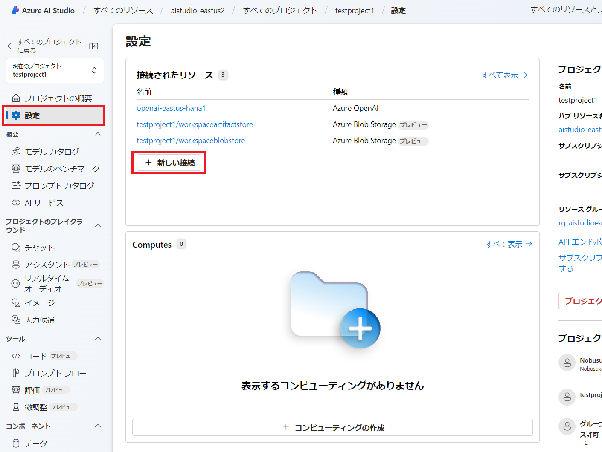
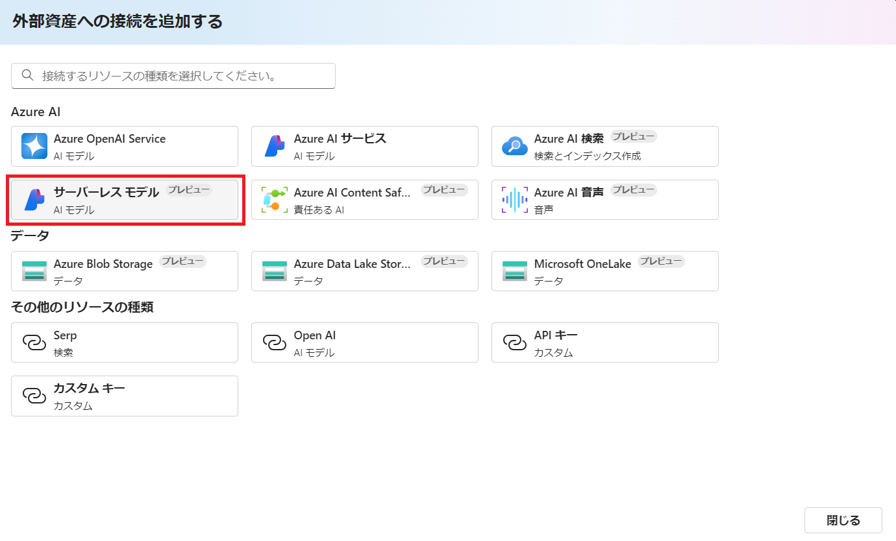
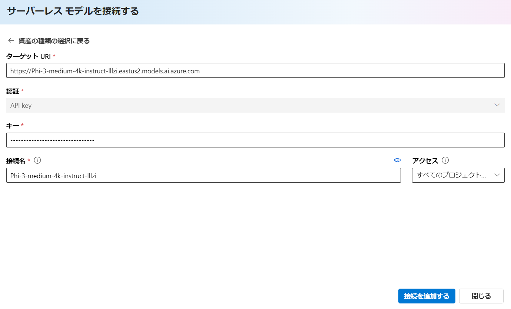
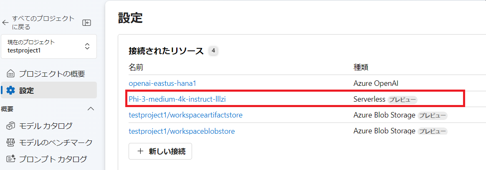

# Models as a Services(MaaS) の作成
1. 左のメニューから「モデルカタログ」を選択します。モデルフィルターの「コレクション」から「Microsoft」をチェックします。

    

1. Microsoft が提供するモデルの一覧が表示されるので、`Phi-3-medium-4k-instruct` をクリックします。

    

1. 上部の「デプロイ」ボタンをクリックします。デプロイオプションでは左の「サーバーレスAPI」を選択します。

    

1. デプロイ設定で任意のデプロイ名を入力して「デプロイ」ボタンをクリックします。

    

> [!WARNING]
> モデルがデプロイ可能なリージョンと Azure AI Studio ハブのリージョンが異なっていた場合、モデルをデプロイしたいリージョンにハブを再作成することになります。

5. デプロイは数秒で完了します。

    

    ターゲット URI とキーをメモ帳にコピーしておきます。

## 接続の作成
モデルのデプロイ後、実際にプロンプトフローから使えるようにするには、接続の設定が必要です。

1. モデルのデプロイが完了したら、Azure AI Studio プロジェクトの左メニューから「設定」をクリックして「＋新しい接続」ボタンをクリックします。

    

1. 「外部資産への接続を追加する」画面で「サーバーレス モデル」をクリックします。

    

1. コピーしておいたターゲット URI とキーを貼り付けて「接続を追加する」をクリックします。

    

1. 接続設定に追加されていることを確認します。

    

#
[←戻る](./README.md)