# Azure AI Content Safety のテスト

> [!WARNING]
> Azure AI Content Safety の**コンテンツフィルタやブロックリストなどの一部の機能は Azure OpenAI Service に統合されていますのでフル機能が不要であれば作成する必要はありません。**。今回は Azure AI Studio 上からすべての機能のデモを実施するために別途 Azure AI Content Safety リソースを作成します。

1. [Azure AI Content Safety Azure リソース](https://aka.ms/acs-create)を作成します。必要事項を以下のように入力して「確認および作成」をクリックします。※今回は「East US 2」リージョンに作成します。

    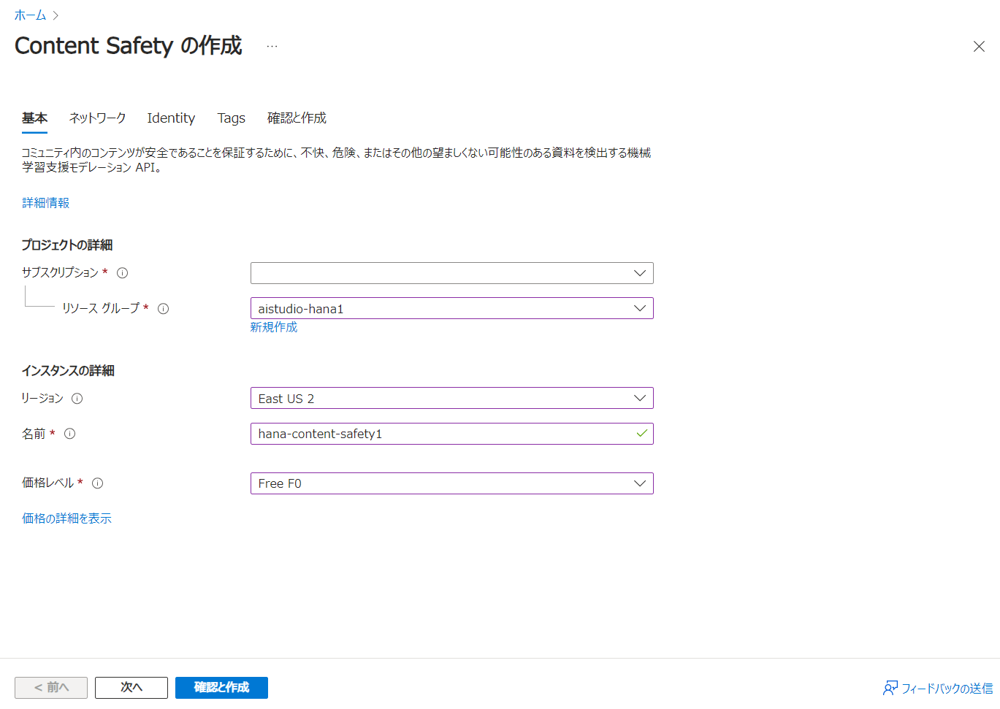

    価格レベルは「Free F0」でかまいません。

1. 内容を確認して「作成」ボタンをクリックします。

    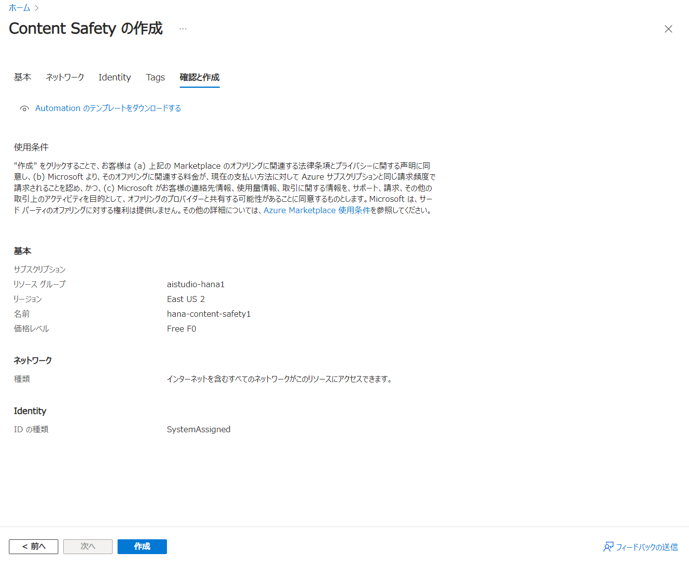

> [!NOTE]
> Azure AI Content Safety は [Content Safety API](https://ms.portal.azure.com/verifyLink?href=https%3A%2F%2Faka.ms%2Facs-api&id=Microsoft_Azure_ProjectOxford) および [Content Safety Studio](https://ms.portal.azure.com/verifyLink?href=https%3A%2F%2Faka.ms%2Facsstudio&id=Microsoft_Azure_ProjectOxford) から起動できますが、Azure AI Studio とも統合されているため、今回は Azure AI Studio 上から操作します。

1. リソースの作成が完了したら Content Safety リソースへ移動し、左メニューの「アクセス制御(IAM)」から上部「＋追加」ドロップダウンを選択し、「ロール割り当ての追加」をクリックします。

    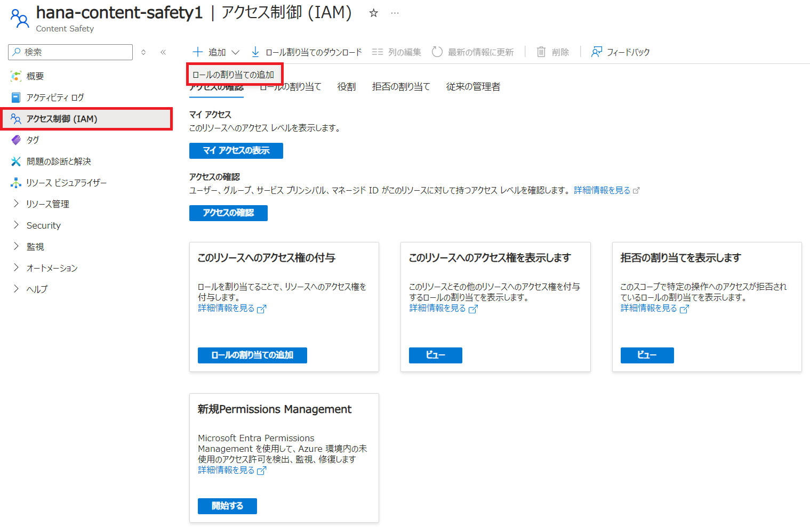

1. ロール割り当ての追加から「Cognitive Services ユーザー」を選択し、次へをクリックします。

    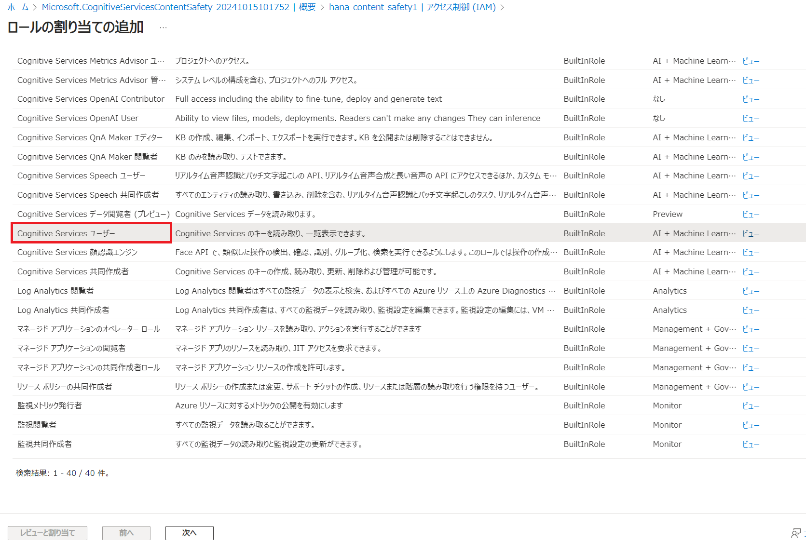

1. 「＋メンバーを選択する」をクリックして、自分の名前を検索して選択します。追加できたら、「レビューと割り当て」をクリックします。内容を確認してもう一度「レビューと割り当て」をクリックします。

    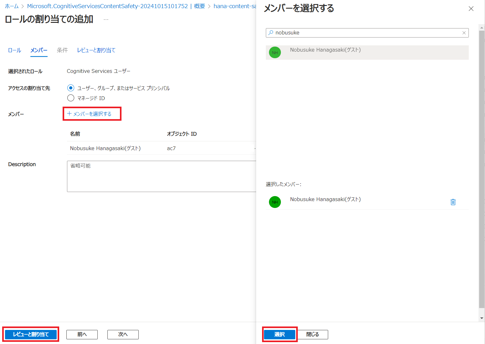

1. Cognitive Services ユーザーに自分が含まれていることを確認します。

    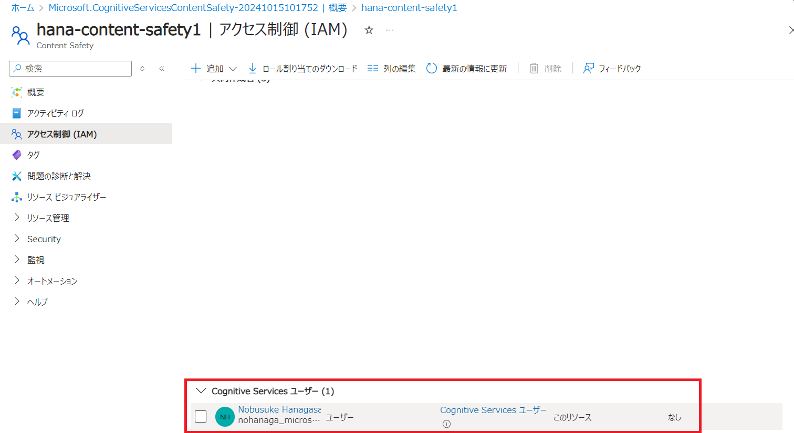

1. 次に、[Azure AI Studio](https://ai.azure.com/) を起動します。左上の「Azure AI Studio」ロゴをクリックして TOP 画面を開きます。TOP 画面の「ソリューションに AI サービスを吹き込む」セクションから 「Content Safety」の箱をクリックします。

    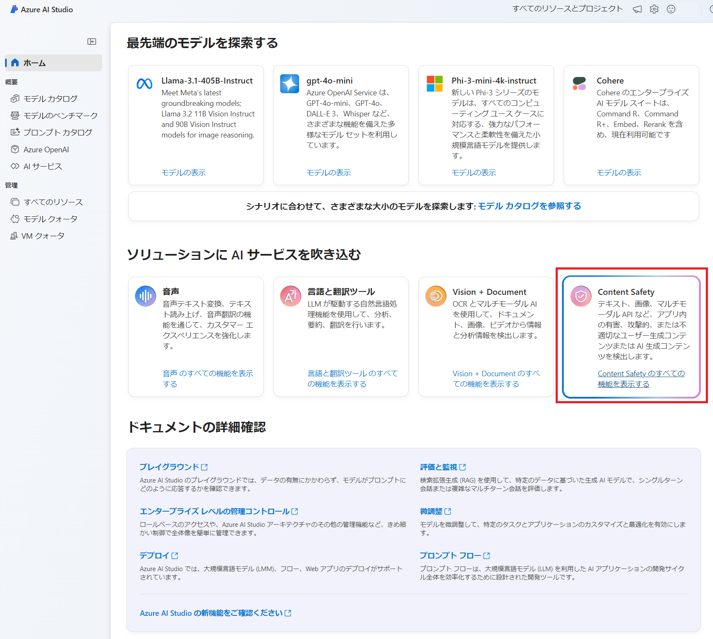

1. Content Safety にはテキストコンテンツの保護だけでなく、画像コンテンツの保護機能も搭載されています。まずは「適度なテキスト コンテンツ」を選択してフィルタリングを検証します。

    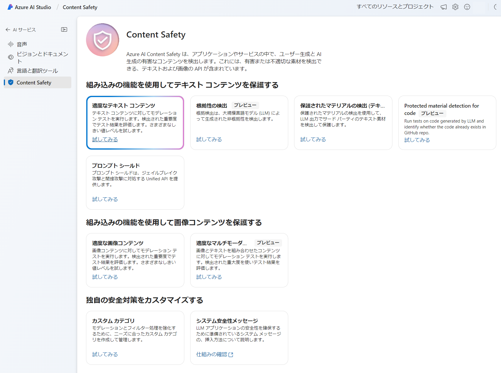

1. Azure AI サービスドロップダウンで先ほど作成した Content Safety リソースを選択します。

    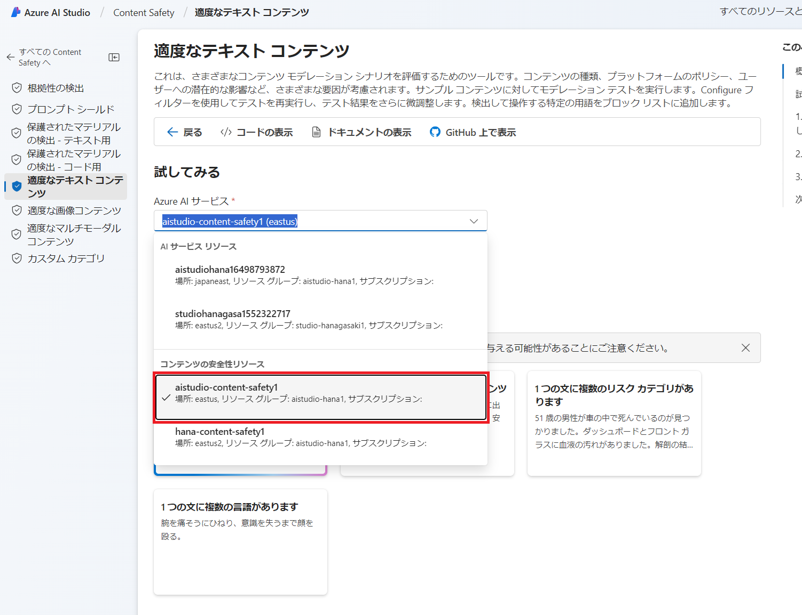

> [!WARNING]
> サンプルを選択する前に、各サンプルのコンテンツの一部が不快感を与える可能性があることにご注意ください。

1. このスタジオでは様々な種類のテキストコンテンツについてのフィルタリングテストを試すことができます。「安全なコンテンツ」ボックスをクリックしてサンプルテキストをロードして「テストの実行」をクリックします。

    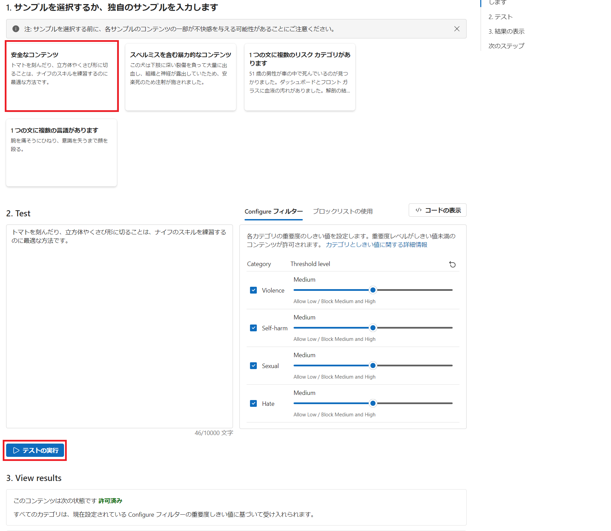

    ```
    トマトを刻んだり、立方体やくさび形に切ることは、ナイフのスキルを練習するのに最適な方法です。
    ```

    View results 欄に「許可済み」と表示されればそのテキストはフィルターされなかったと判断できます。「Configure フィルター」の 4 つのカテゴリーのバーを左に移動させればより厳しく、右に移動させればより緩くなります。

    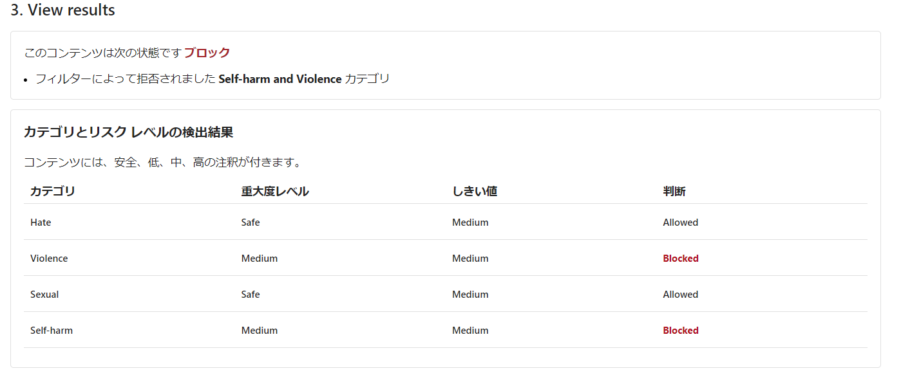

1. 次にブロックリスト（NGワードリスト）を試します。「ブロックリストの使用」タブをクリックして、「ブロックリストの追加→新しいブロックリストの作成」を選択します。任意の名前を英数字で指定して作成します。

    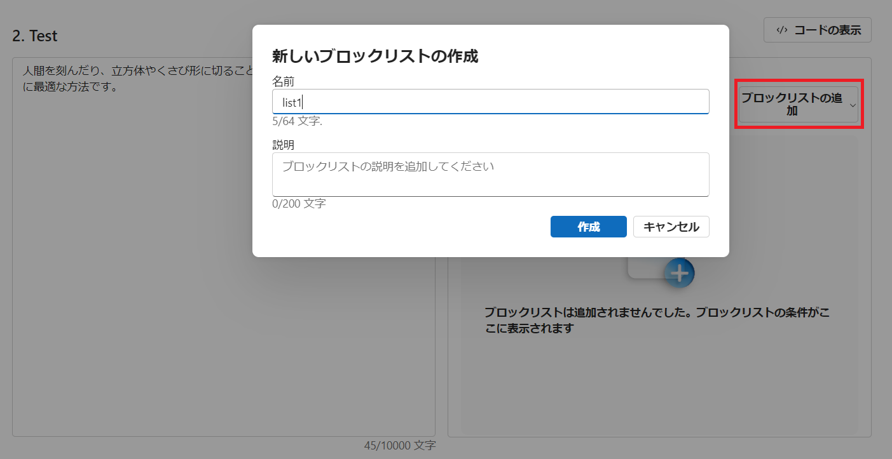

1. 作成したブロックリストに NG ワード指定したい単語を追加していきます。マッチ方法には完全一致と正規表現が利用可能です。

    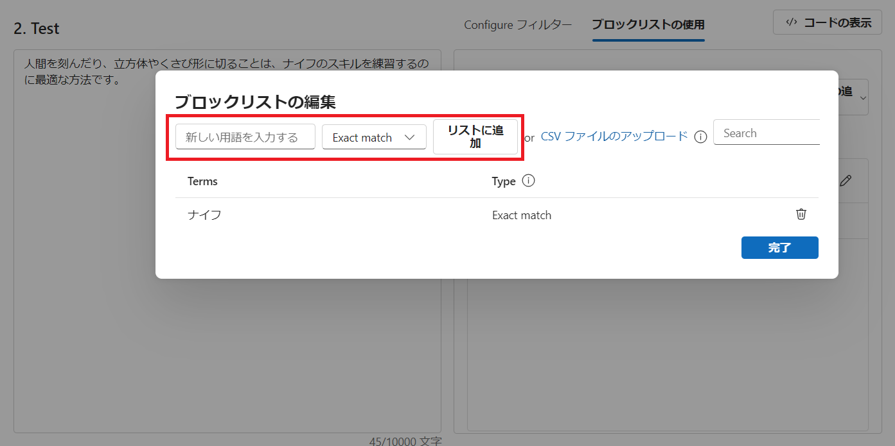

    ```
    ナイフ
    ```
    をリストに追加して「テストの実行」をクリックします。

1. View results でブロックリストに引っかかったことが確認できます。

    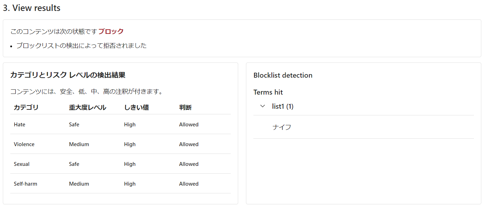

必要に応じて、他の機能もテストします。

## Content Safety 機能一覧
1. [根拠性の検出（Groundedness detection）](https://learn.microsoft.com/azure/ai-services/content-safety/concepts/groundedness):
グラウンデッドネス検出は、大規模言語モデル (LLM) によって生成された非グラウンデッド コンテンツを、グラウンディング ソースと比較してチェックします。推論機能は、コンテンツが非グラウンデッドである理由を説明し、修正機能は、非グラウンデッド コンテンツを修正するための提案を提供します。

1. [プロンプト シールド](https://learn.microsoft.com/azure/ai-services/content-safety/concepts/jailbreak-detection):
脱獄攻撃と間接攻撃に対処する統合 API を提供します。以前はジェイルブレイク リスク検出と呼ばれていたこのシールドは、ユーザー プロンプト インジェクション攻撃を対対象にしています。この攻撃では、ユーザーが意図的にシステムの脆弱性を悪用して、LLM から未承認の動作を引き出します。これにより、不適切なコンテンツが生成されたり、システムで課される制限に違反したりする可能性があります

1. [保護されたマテリアル テキストの API](https://learn.microsoft.com/azure/ai-services/content-safety/concepts/protected-material?tabs=text):
保護されたマテリアル テキストの API は、大規模言語モデルによって出力される可能性のある既知のテキスト コンテンツ (曲の歌詞、記事、レシピ、選択した Web コンテンツなど) にフラグを設定します。

1. [保護済み素材コード API](https://learn.microsoft.com/azure/ai-services/content-safety/quickstart-protected-material-code):
コード用の保護されたマテリアル機能は、既存の GitHub リポジトリのコードと一致する AI 出力を識別するための包括的なソリューションを提供します。 この機能により、エンド ユーザーに対する透明性が向上し、組織のポリシーへのコンプライアンスが促進される形で、自信を持ってコード生成モデルを使用できるようになります。

1. [危害カテゴリ](https://learn.microsoft.com/azure/ai-services/content-safety/concepts/harm-categories?tabs=warning): Content Safety により、不快なコンテンツの 4 つの異なるカテゴリが認識されます。ヘイトと公平性、性的、暴力、自傷行為です。サービスで適用されるすべての危害カテゴリには、重大度レベルも含まれます。 重大度レベルは、フラグが設定されたコンテンツを表示した結果の重大度を示すためのものです。テキストコンテンツだけでなく、画像コンテンツ、マルチモーダルコンテンツの保護も可能です。

1. [カスタム カテゴリ](https://learn.microsoft.com/azure/ai-services/content-safety/concepts/custom-categories?tabs=standard):
モデレーションとフィルター処理を強化するために、ニーズに合わせてコンテンツ カテゴリを作成し管理します。サンプル データをアップロードし、カスタムの機械学習モデルをトレーニングし、それを使用すると、定義済みのカテゴリに従って新しいコンテンツを分類できます。


#
[←戻る](./README.md)